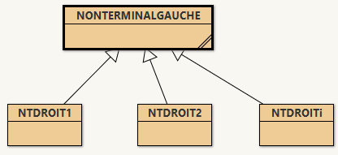

# Structure et Composition : Ed en autonome

Autour des expressions mathématique simple, pour montrer les design pattern 
* Composite,
* Visiteur,
* Template,
* Strategie,
* Interpreteur,
* Factory

## La grammaire simplifiée

* **MAJUSCULE GRAS** : non terminal sera modélisé par une Classe
* **minuscule gras** : un presque terminal (par exemple operation qui est en fait une des string +, - , ...) qui est un non Terminal mais nous le considérerons dans notre exemple comme un caractère spécial pouvant prendre une valeurs parmi plusieurs.
* minuscule : terminal exemple nombre, symbole, caractère spécial, ...

1. **EXPRESSION** ::= **CONST** | **ExpressionB**
2. **CONST** ::= nombre entier
3. **op** ::= + | - | * | /
4. **ExpressionB** ::= (**EXPRESSION** **op** **EXPRESSION**)

ou (à la place de 3, 4)

3. **ExpressionB** ::= ( **ADD** | **SOUS** | **MULT** | **DIV** )
4. **ADD**         ::= **EXPRESSION** + **EXPRESSION**
5. **SOUS**        ::= **EXPRESSION** - **EXPRESSION**
6. **MULT**        ::= **EXPRESSION** * **EXPRESSION**
7. **DIV**         ::= **EXPRESSION** / **EXPRESSION**


## Voir la première version V0.1 

1. Faire clone du projet
2. Après le clone git checkout V0.1 (attention V0.1 n'est pas une branche mais un commit historique)
3. Ouvrir dans bluej le projet se trouvant `dans le repertoire <racine>/ExpMath/src/main/java

## Quelques règles
### Une règles de ce genre Non terminaux droite et gauche un | entre nom terminaux 

**NONTERMINALGAUCHE** ::= **NTDROIT<sub>1</sub>** | **NTDROIT<sub>2</sub>** | ... | **NTDROIT<sub>i</sub>**

Est traduit avec le **design pattern composite** ainsi



### Une règles de ce genre Non terminaux droite et à gauche des terminaux et nom terminaux en séquence

> Les non terminaux disparaissent en principe, ne servent que pour aider la syntaxe. Nous verrons qu'il permettront de choisir quoi faire seront utile pour construire un arbre syntaxique abstrait ou traduire : design pattern factory et startegy

**ExpressionB** ::= (**EXPRESSION** **op** **EXPRESSION**)

On applique la composition (pas le design pattern mais la composition d'objets)

```java
class ExpressionB {
    Expression e1;
    Op op;
    Expression e2;

    //.....
}
```

==> Regarde ce que tout ceci donne en première version ouvrir dans blueJ <racine>/ExpMath/src/main/java

# Quelques questions de réflexion:

1. Que représente la méthode dans les classes du genre?

> ```public static Type create(parametres)```

2. D'après vous pourquoi le constructeur est private?
